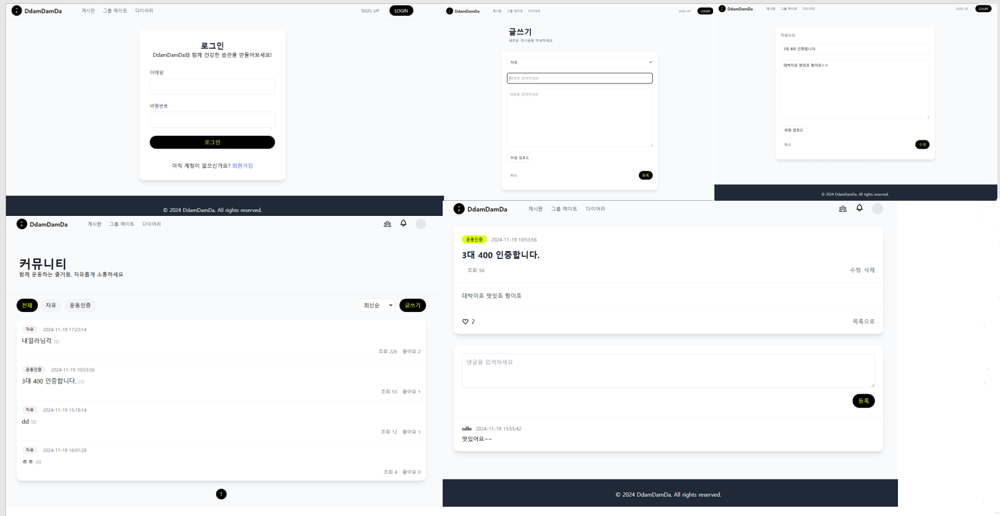
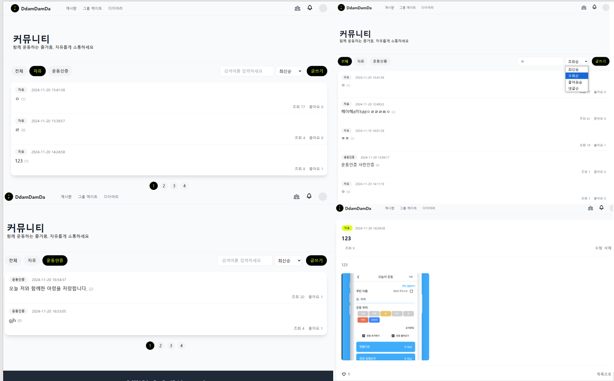
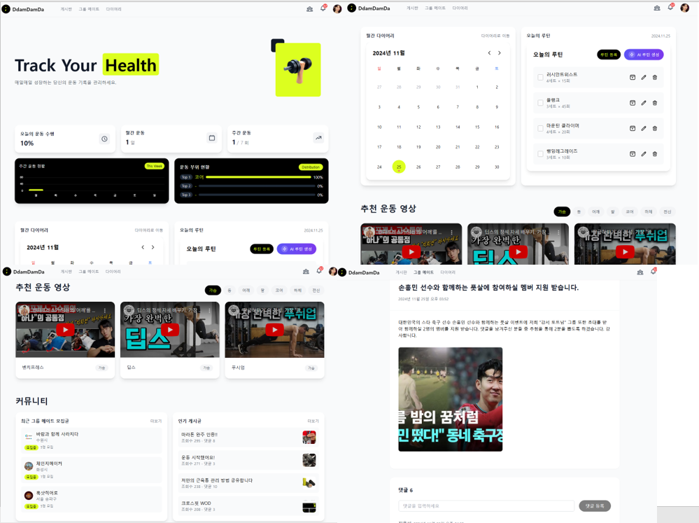
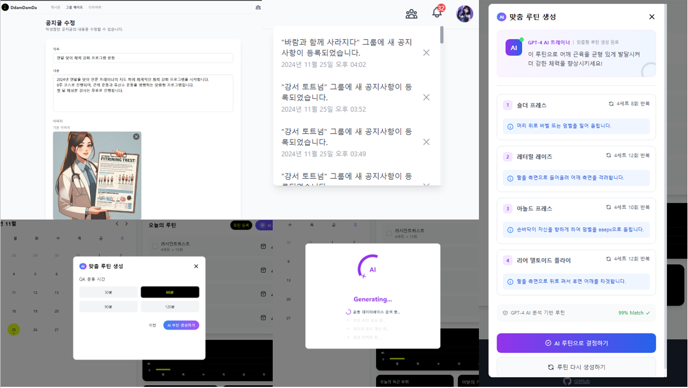
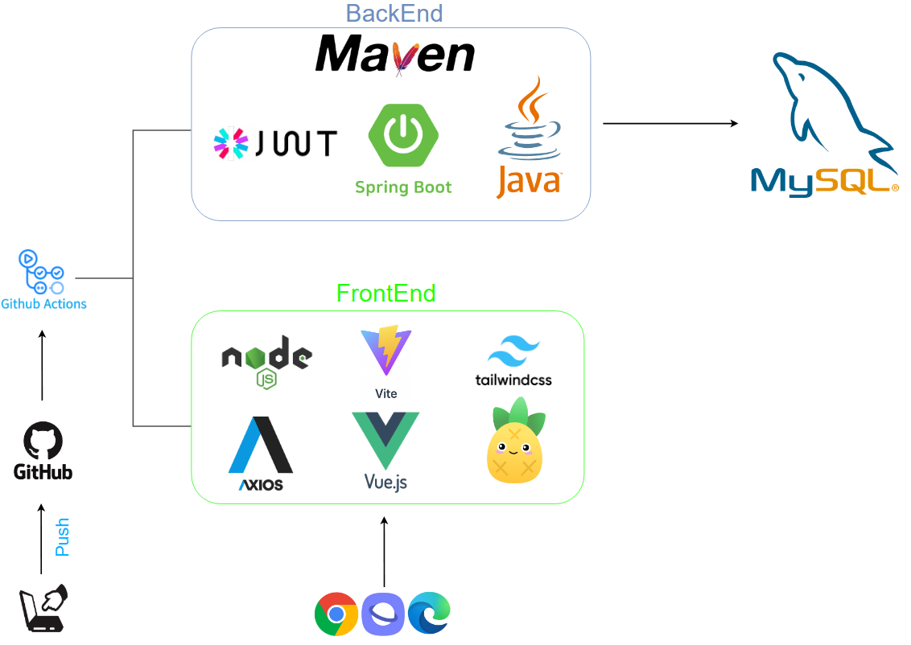
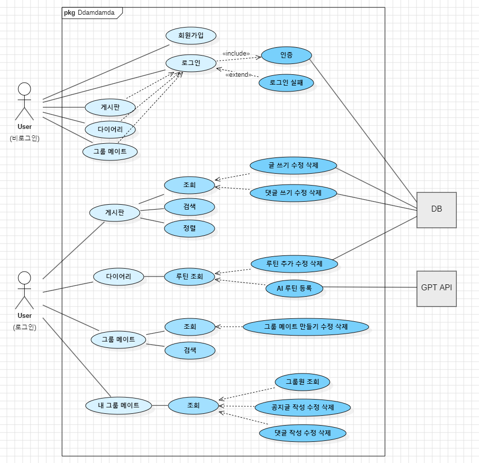
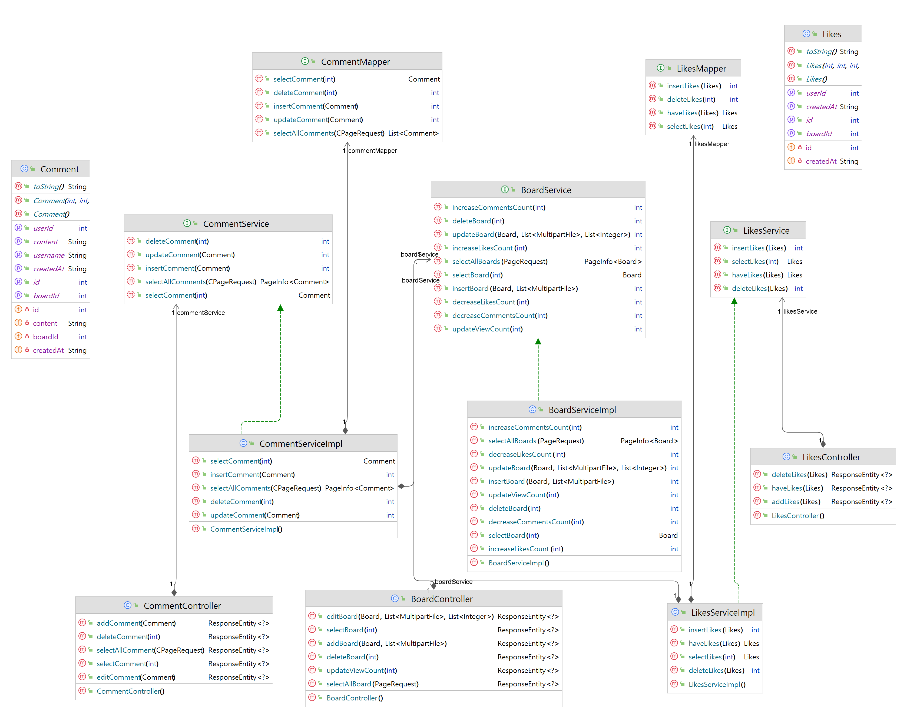
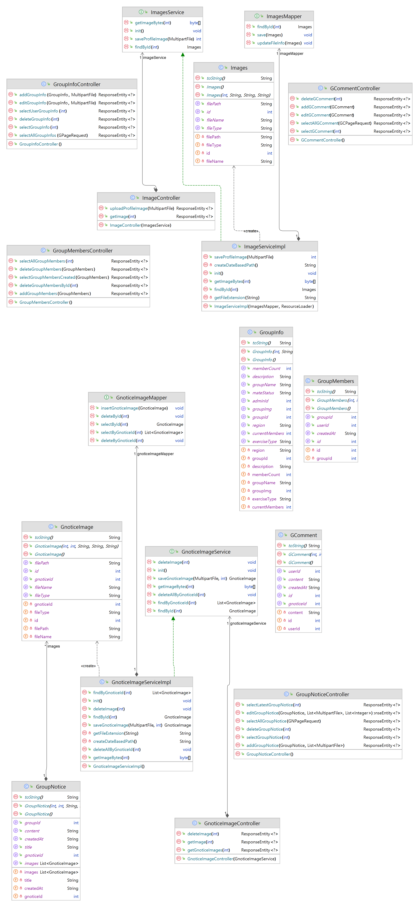
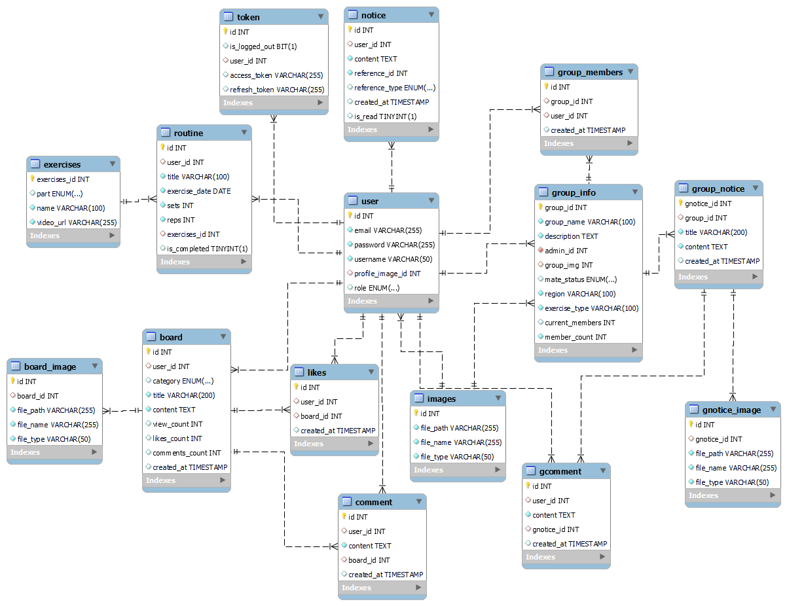

# 🏋️‍♂️ DdamDamDa (땀담다)

**내 운동 일정을 기록하고, 공유하며 함께 성장하는 피트니스 소셜 플랫폼**  
 

## 📝 프로젝트 소개

> ### [최종 PPT 보러가기](산출물/땀담다_전체페이지.pptx)
DdamDamDa는 운동을 사랑하는 모든 사람들을 위한 종합 피트니스 플랫폼입니다. 개인의 운동 일정 관리부터 운동 메이트 찾기, 커뮤니티 활동까지 - 당신의 건강한 라이프스타일을 위한 모든 것을 담았습니다.  
 

## 📝 참고자료

> ### [팀 노션 페이지](https://www.notion.so/PJT-136634ecbbc48068a295efd5d3e5fcb5?pvs=4)

> ### [요구사항 정의서](https://docs.google.com/spreadsheets/d/16uS-oSijpuOd-1RVGpClQE0FbH4ZhtV82RlkieFNbzw/edit?usp=sharing)
 

<h1>📚 STACKS</h1>

 
   
   

  
  
   
  
   
  
   
   
  
   
   
  
    
  
     
   

  
   
  
  
  
   

### 🎯 주요 기능

1. **운동 루틴 관리**
   - 개인별 맞춤 운동 루틴 설계
   - 일별 운동 기록 및 진행 상황 체크
   - 다양한 운동 종류별 가이드 제공

2. **운동 메이트 시스템**
   - 지역별 운동 그룹 생성 및 참여
   - 그룹별 공지사항 및 소통 기능
   - 실시간 멤버 현황 확인

3. **커뮤니티**
   - 자유로운 피트니스 정보 공유
   - 운동 인증 게시판
   - 좋아요, 댓글 기능을 통한 활발한 소통
 

## 💾 데이터베이스 설계

### ERD (Entity Relationship Diagram)

### 📋 테이블 구조 및 관계 설명

#### 🔷 핵심 사용자 관련 테이블
1. **User**
   - 사용자 기본 정보 관리 (이메일, 비밀번호, 사용자명)
   - 프로필 이미지는 `images` 테이블과 연동
   - 역할 구분 (ADMIN/USER)

2. **Routine**
   - 사용자별 운동 루틴 관리
   - 운동 종류, 세트 수, 반복 횟수 등 상세 정보 포함
   - `exercises` 테이블과 연계하여 표준화된 운동 정보 제공

#### 🔷 커뮤니티 관련 테이블
1. **Board & Comment**
   - 자유/운동인증 카테고리 구분
   - 게시글에 대한 이미지 첨부 기능 (`board_image`)
   - 조회수, 좋아요수, 댓글수 자동 집계
   - 댓글 시스템으로 활발한 소통 지원

2. **Likes**
   - 사용자별 게시글 좋아요 관리
   - 중복 좋아요 방지를 위한 유니크 키 설정

#### 🔷 그룹 활동 관련 테이블
1. **Group_info**
   - 운동 그룹의 기본 정보 관리
   - 지역, 운동 유형, 모집 상태 등 상세 정보 포함
   - 현재 멤버 수 자동 관리

2. **Group_notice & Gcomment**
   - 그룹별 공지사항 관리
   - 공지사항 이미지 첨부 기능
   - 그룹원간 소통을 위한 댓글 시스템

#### 🔷 알림 시스템
- **Notice**
  - 좋아요, 댓글, 그룹 공지, 멤버 참여 등 다양한 활동 알림
  - 읽음 여부 확인 기능

### 🔐 보안 및 인증
- **Token**
  - 사용자 인증을 위한 JWT 토큰 관리
  - Access Token과 Refr
   

## 📝 업데이트 내역
### 📌 ~ 2024-11-18
- **와이어 프레임 생성 완료**

- **BackEnd 기능 구현 내역**
   - 유저 관련 기능 구현
   - 유저 이름, 닉네임 유효성 검사 추가 / exercises 로직 수정
   - user edit 기능 구현 초안
   - 프로필 이미지 업로드 기능구현
   - 프로필 이미지 저장, 불러오기 구현 및 테스트 완료
   - 운동 전체 / 부위별 리스트 가져오기 기능 구현
   - Routine 기능 구현
   - board Updating
   - 이미지 관련 기능 구현
   - BoardMapper 생성
   - board 기능 구현 중
   - board 기능 구현
   - board 기능 구현 완료
   - group 기능 구현 중

### 📌 2024-11-19
- **FronEnd 기능 구현 내역**
   - 게시판 구현 중
   

- **BackEnd 기능 구현 내역**
   - id 유저 검색 기능 추가
   - Routine method 파라미터 변경
   - board Search 조건 변경
   - group 기능 구현 완료
   - Comment username 데이터 추가
   - UserMapper findUsernameByID 추가
   - haveLikes method Mapping 변경
   - Notice 기능 구현 완료

### 📌 2024-11-20
- **FronEnd 기능 구현 내역**
   - 게시판 구현 완료
   
   - 게시글 카테고리, 검색바, 이미지 랜더링 구현
   

- **BackEnd 기능 구현 내역**
   - insertNotice 구문 수정
   - Images 기능 구현 완료
   - deleteComment service 로직 수정
   - routine 에러코드 수정
   - DeleteLikes 로직 변경
   - 조회수 증가 로직 수정
   - BoardImage 기능 구현 완료
   - GnoticeImage 기능 구현 완료

### 📌 2024-11-21
- **FronEnd 기능 구현 내역**
   - 카테고리별 페이지네이션 에러 해결
   - 댓글 수정 에러 해결
   - 프로필 세팅 페이지 생성
   - 프로필 이미지 불러오기
   - 프로필 수정 반영
   - 비밀번호 조건 검사
   - 닉네임 중복 검사
   - 로그인 로그아웃 토큰 연동
   - 헤더 프로필 이미지 불러오기
   

- **BackEnd 기능 구현 내역**
   - deleteComment 로직 수정
   - Routine AI 기능 구현 완료
   - uploadProfileImage메서드 수정
   - editProfile 설명 추가
   - 유저 삭제 기능 추가

### 📌 2024-11-22

- **FronEnd 기능 구현 내역**
   - groupInfo Image 처리 수정
   - groupInfo 페이지 수정
   - Group 페이지네이션 추가, css수정
   - 다이어리 페이지 구현(AI, 그래프 영역 제외)
   - groupDetail 페이지 추가
   

- **BackEnd 기능 구현 내역**
   - AI 루틴 추천 프롬프트 수정
   - deleteUserGroupMember 구문 수정
   - selectLatestGroupNotice 메서드 추가
   - groupInfo 로직 수정, groupNotice 로직 수정

### 📌 2024-11-23 ~ 2024-11-25

- **FronEnd 기능 구현 내역**
   - GroupNotice 작성폼, 디테일 추가
   - AI답변 모달 구현, 영상 모달 구현, 차트 구현 완료
   - 그룹 메이트 관리자 페이지, 그룹 공지글 수정 페이지 추가
   - Notice(알림) 컴포넌트 구현 완료
   - 유저 결함 수정 완료
   - 홈페이지 구현 완료
   - 미래 루틴 접근불가 처리
   - Rotuer Guard 설정 수정
   

- **BackEnd 기능 구현 내역**
   - GroupInfo 생성 로직 수정
   - 멤버 가입일 가져오는 메서드 추가
   - 패스워드 유효 검사 로직 추가
   - security 설정 변경

- **⚠️ 모든 기능 구현 완료 및 더미데이터 추가 완료 ⚠️**

### 📌 2024-11-26

- **업데이트 내역**
   - 서비스 아키텍처 이미지 업데이트
   - UseCase 다이어그램 이미지 업데이트
   - UML 이미지 업데이트
   - ERD 이미지 업데이트

---
> ### [최종 PPT 보러가기](산출물/땀담다_전체페이지.pptx)
